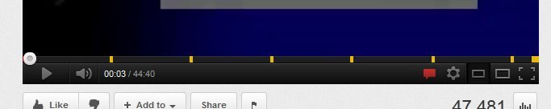

MediaElement-Markers - Youtube style markers on the Progress bar

# Introduction

MediaElement-Markers is a MediaElement.js plugin that lets you add ___Visual Cues___ in the progress bar. This plugin also lets you register a custom callback function that will be called everytime the play position reaches a marker. Marker position and a reference to the MediaElement Player object is passed to the registered callback function for any post processing. 

# Credits

My Employer - [Sourcebits Inc.](http://www.sourcebits.com)

Thanks to [John Dyer](https://github.com/johndyer), creator of [MediaElement Player](https://github.com/johndyer/mediaelement)
